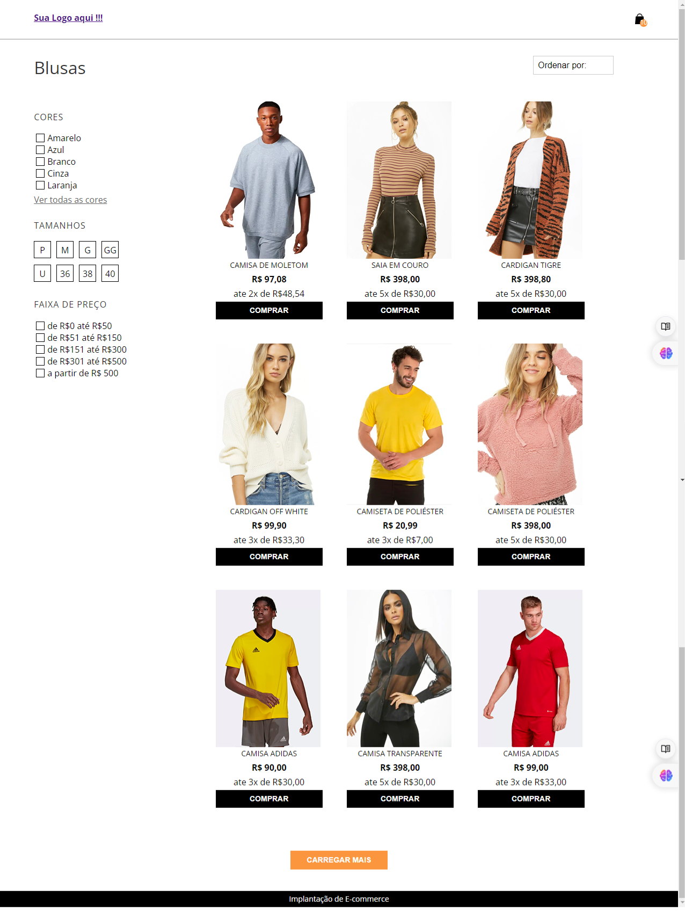

### <h1>PROJETO DE CONSTRUÇÃO DE UMA PAGINA DE CATEGORIA </h1>
esse projeto tem como finalidade deixar uma pagina de categoria funcional, onde todos os elementos tornem-se dinamicos, como carrinho de compra ao clicar no botão de comprar, os filtros de preço, tamanho e um range com variação de preço e resposividade no mobile

### <h2> para o funcionamento do projeto será necessario: </h2>
rodar na porta 3000 -- localhost:3000
### npm run dev 

### <h2>consumir a API  na porta 5000 </h2>

no Repositorio:
### json-server-eccomerce-category-page
execute: 
### json-server ./db.json --port 5000

